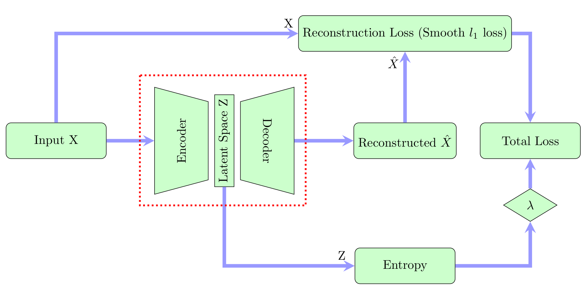

# Sparse Compressive AutoEncoder

This is the code from :

> *Learning sparse auto-encoders for green AI image coding.* Gille C., Guyard F., Antonini M., Barlaud M.

## Scripts

Most scripts in this repository are utility scripts, except for `Training.py`, which should be executed to train a model.

## Dataset

The dataset used to train this network is not provided in this repository, but is [available freely on github](https://github.com/CyprienGille/flickr-compression-dataset).